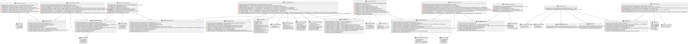
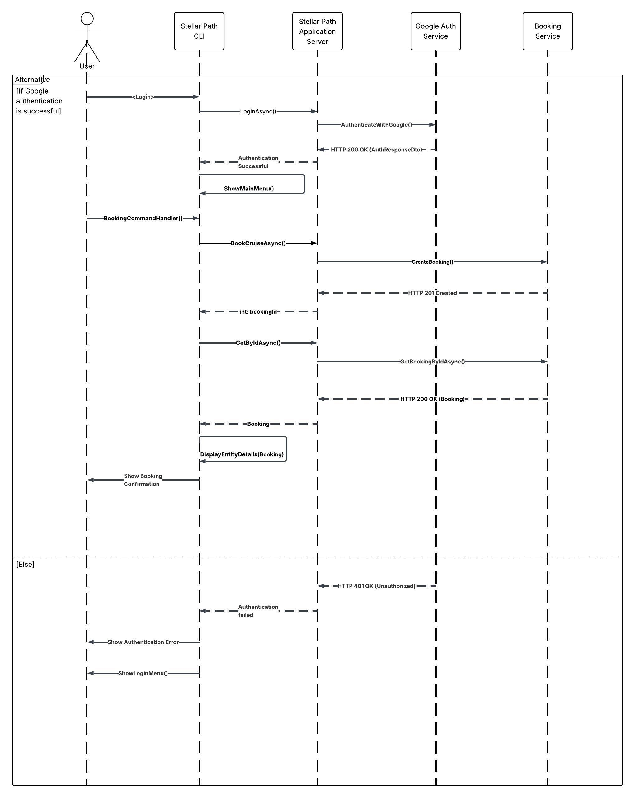

# StellarPath

StellarPath is a project that provides a CLI application for intergalactic travel management, with features to book a trip, see available trips, cancel a booked trip, and to list all destinations that can be visited

## Getting Started

## Docker related commands

Ensure target exists
dotnet run -- build

- run docker-compose file

### Prerequisites

- .NET 9.0.203+

### Running the Server

1. Open a terminal or command prompt.
2. Navigate to the `api` directory:
    ```sh
    cd API\src\StellarPath.API

    dotnet run
    ```
You can access the API from port 5291 on your local browser:
http://localhost:5291/swagger/index.html

### Running the CLI Application

1. Open a terminal or command prompt.
2. Navigate to the `cli` directory:

    ```sh
    cd CLi

    cd src
    ```

3. Run the CLI application:

    ```sh
    dotnet run
    ```

### Features

- Google OAuth2 authentication
- Intergalactic Travel Management

### Project Structure

- `api/`: Contains the backend API for the project.
- `cli/`: Contains the CLI application for the project.


### Use Case Diagram


### Class Diagram




### Sequence Diagram

